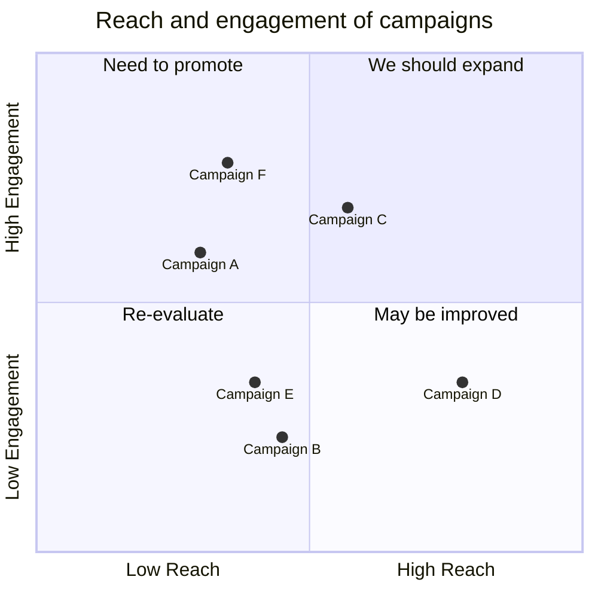

---
{"dg-publish":true,"permalink":"/Contemplation/Home/","tags":["gardenEntry"]}
---

## About me
### Introduction
Test front-end rendering. 
~~这里是中国中央电视台。重复，这里是中国中央电视台。~~ This is an inline $e^{2i\pi} = 1$ math expression using [MathJax](https://docs.mathjax.org/en/latest/basic/mathjax.html).
Here is a rather crude personal website under construction referencing to the [DigitalGarden](https://github.com/oleeskild/Obsidian-Digital-Garden) plugin, which is based on Obsidian notes and deployed in Netlify.

### Mermaid Case

## Notes  List
- [[Contemplation/Books/去依附\|董筱丹, 温铁军. 去依附[M]. 东方出版社, 2019-9-1.]]