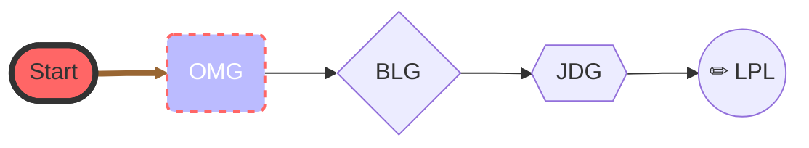

---
{"dg-publish":true,"permalink":"/Contemplation/Home/","tags":["gardenEntry"]}
---

## About me
### Introduction
~~这里是中国中央电视台。重复，这里是中国中央电视台。~~ 使用 $$ latex$$ 测试网站渲染。$$ a^2 + b^2 = c^2 $$ 测试结束。

### Mermaid Case

## Notes  List
- [[Contemplation/Books/去依附\|《去依附》]]